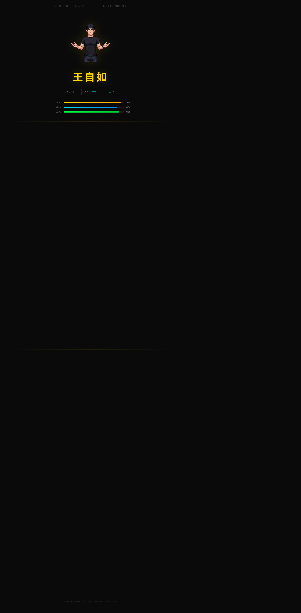

# 王自如项目仓库

这是一个围绕“王自如”主题整理的静态展示项目仓库，主入口位于 [wangziru-hub/index.html](wangziru-hub/index.html)。仓库内容包含主视觉页面、设计演示页、像素风素材和预览脚本，适合本地直接打开查看，也便于继续扩展成完整的展示站点。

## 项目概览

- [wangziru-hub](wangziru-hub) - 主展示页、设计演示和预览脚本
- [像素ui](像素ui) - 角色素材与像素风资源

## 主要内容

- [wangziru-hub/index.html](wangziru-hub/index.html) - 站点主页面
- [wangziru-hub/design-demos](wangziru-hub/design-demos) - 多个设计演示页面
- [wangziru-hub/preview](wangziru-hub/preview) - Playwright 录制与视频转换脚本

## 项目截图

主页面实际截图：



仓库里还保留了可直接用于说明的素材预览图：

- [像素ui/sprite_pack_preview_3af0c39e.png](像素ui/sprite_pack_preview_3af0c39e.png) - 像素角色素材总览
- [像素ui/01_演讲姿势男性.png](像素ui/01_演讲姿势男性.png) - 人物姿态示例
- [像素ui/02_持笔指引男性.png](像素ui/02_持笔指引男性.png) - 人物动作示例

## 预览目录

`preview` 目录里的脚本用于录制页面并转换成视频，依赖在 [wangziru-hub/preview/package.json](wangziru-hub/preview/package.json)。

重新安装依赖：

```bash
cd wangziru-hub/preview
npm install
```

## 本地查看

直接在浏览器打开 [wangziru-hub/index.html](wangziru-hub/index.html) 即可查看主页面。